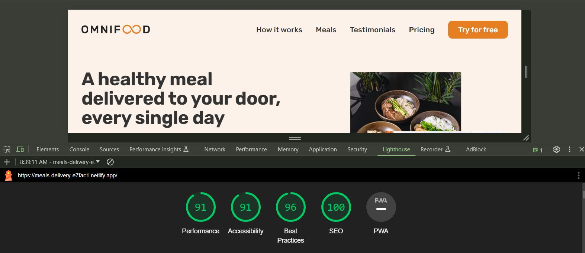

# Build Responsive Real World Websites with HTML5 and CSS3

## Deployed at Netlify: [Omnifood-meals-delivery-website](https://meals-delivery-e7fac1.netlify.app/)

## 🥡🍱 Omnifood final Project

This is a project from the Udemy course [Build Responsive Real World Websites with HTML5 and CSS3](https://www.udemy.com/course/design-and-develop-a-killer-website-with-html5-and-css3/) by Jonas Schmedtmann. The course is a great way to learn how to build a website from scratch using HTML5 and CSS3. The course also covers how to make the website responsive and how to use the latest features of HTML5 and CSS3.

## ⚙ Technologies used

1. HTML and CSS fundamentals techniques
2. Layout: Floats, Flexbox, and CSS Grid
3. Components and Layout Patterns
4. Responsive Design and Media Queries
   - Breakpoints
   - Responding to different screen sizes (mobile, tablet, and desktop)
   - Media queries including:
     - BELOW 1344px (Smaller desktops)
     - BELOW 1200px (Landscape Tablets)
     - BELOW 944px (Tablets)
     - MOBILE NAVIGATION
     - BELOW 704px (Smaller tablets)
     - BELOW 544px (Phones)
5. Sticky Navigation
6. Browser support and fixing css flexbox gap in Safari
7. Testing Performance with Lighthouse
8. Image Optimization
9. Deployment

## 🛠 Very useful tools and resources

### 💖 If you have other useful websites, welcome to contribue this list, thank you. 🙌

| Details                                                                                                 | Websites                                                                                                                                                                                                                                                                           |
| ------------------------------------------------------------------------------------------------------- | ---------------------------------------------------------------------------------------------------------------------------------------------------------------------------------------------------------------------------------------------------------------------------------- |
| Tints and shades generator                                                                              | https://maketintsandshades.com/                                                                                                                                                                                                                                                    |
| ionicons                                                                                                | https://ionicons.com/                                                                                                                                                                                                                                                              |
| Good website for debugging                                                                              | https://validator.w3.org/ https://diffchecker.com/                                                                                                                                                                                                                                 |
| Implementing Typography                                                                                 | https://typescale.com/                                                                                                                                                                                                                                                             |
| Google fonts                                                                                            | https://fonts.google.com/specimen/Inter?query=inter                                                                                                                                                                                                                                |
| Color Palette                                                                                           | https://yeun.github.io/open-color/                                                                                                                                                                                                                                                 |
| Contrast checker                                                                                        | https://coolors.co/contrast-checker/112a46-acc8e5                                                                                                                                                                                                                                  |
| Image resource                                                                                          | https://unsplash.com/                                                                                                                                                                                                                                                              |
| Icon resource:   Use only one icon pack, don't mix and match.   Use SVG icons or icon fonts.   | https://heroicons.com/                                                                                                                                                                                                                                                             |
| shadow resource                                                                                         | mdn box shadow                                                                                                                                                                                                                                                                     |
| UX notes                                                                                                | Use blue text and underlined text only for links.   Animations be fast between 200ms to 500ms.   Offer users good feedback for all actions: form errors, form success, button click, etc.   Place action buttons where they will create an effect (law of locality).   |
| The missing piece: steal like an artist.                                                                | https://onepagelove.com/inspiration   https://www.awwwards.com/                                                                                                                                                                                                              |
| For individual components                                                                               | https://screelane.com   https://www.land-book.com/                                                                                                                                                                                                                              |
| For component and pattern                                                                               | https://www.appsignal.com/                                                                                                                                                                                                                                                         |
| Brower support                                                                                          | https://caniuse.com/                                                                                                                                                                                                                                                               |
| Image Optimization: finding right balance between image quality and decompression                       | https://squoosh.app.com/                                                                                                                                                                                                                                                           |

Design notes:

1. the actual image size, of the imae file itself should always be double of the size that is actually displayed on the screen. The high density screens aactually need two pixels of the image to display one pixel in the design, in the layout.

2. Here is the result from lighthouse.  

</img>  
